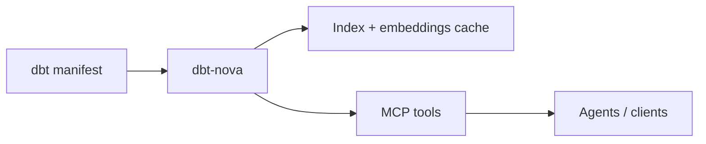

# DBT Nova

[](LICENSE)
[](https://www.rust-lang.org/)
[](https://joe-broadhead.github.io/dbt-nova)
[](https://github.com/joe-broadhead/dbt-nova/releases/latest)


```
    ____  ____ ______   _   __                
   / __ \/ __ )_  __/  / | / /___ _   ______ _
  / / / / __  |/ /    /  |/ / __ \ | / / __ `/
 / /_/ / /_/ // /    / /|  / /_/ / |/ / /_/ / 
/_____/_____//_/    /_/ |_/\____/|___/\__,_/  

     The metadata bridge
          for agents.
```

DBT Nova is the **metadata bridge** between your dbt project and agentic workflows.
In practice, DBT Nova bridges raw dbt artifacts to agent-ready intelligence by
normalizing manifest and `meta.nova` metadata into indexed, queryable
representations and exposing them through MCP tools for discovery, lineage,
scoring, and governance.

Use it with MCP clients to power **team productivity**: analyst, engineer, and
governance skills that deliver trusted answers, safe impact analysis, and
consistent metadata quality.

## What Nova Does

- **Connects dbt to MCP** so agents can discover and reason about your project.
- **Unifies search + lineage + scoring** under one fast local service.
- **Enforces governance** through metadata scoring and compliance signals.
- **Scales with teams** via personas, skills, and standard workflows.

## 30-Second Example

Question:
`"Give me the UK weekly digital KPI report with YoY deltas."`

The agent can run a deterministic workflow:

```json
{"name":"search_recipes","arguments":{"topic":"weekly","query":"digital country","include_queries":true,"limit":5}}
```

```json
{"name":"run_recipe","arguments":{"recipe_id":"weekly_country_kpi_report","parameters":{"COUNTRY_CODE":"GB","WEEK_START":"2026-02-01","WEEK_END":"2026-02-07"},"stop_on_failure":true}}
```

Then optionally validate context and trust:

```json
{"name":"get_context","arguments":{"id_or_name":"model.package.country_kpi_base","include_columns":true,"include_tests":true,"include_upstream":true,"include_downstream":false}}
```

Result:
- One repeatable workflow
- Consistent KPI definitions from dbt + `meta.nova`
- Reusable output format across teams and weeks

## Why Semantic Sovereignty Matters

DBT Nova is built around semantic sovereignty:

- Your definitions live in **dbt code + `meta.nova`**, versioned in your repo.
- Nova reads open dbt artifacts (`manifest.json`) and serves them to agents.
- You can move warehouses or clouds without rewriting your semantic layer into a vendor-specific system.
- Analysts and agents use the same governed definitions engineering maintains.

## How It Works (Short Version)

1. Load a dbt manifest (local or remote).
2. Build indexes + embeddings (cached for fast restarts).
3. Serve MCP tools for search, lineage, coverage, scoring, SQL, and recipe workflows.
4. Agents call those tools through persona skills.

## Architecture at a Glance



## Nova Meta (Core Concept)

Nova meta is the human‑intent layer (`meta.nova`) that powers discovery,
scoring, and governance. Start here:
**[Nova Meta Overview](docs/features/nova-meta-overview.md)**.

## Highlights

- **MCP‑First**: plug into agent runtimes with tool schemas and skills
- **Agent Skills & Personas**: analyst, engineer, governance workflows
- **Deterministic Recipes**: reusable analysis workflows via `search_recipes`, `get_recipe`, `run_recipe`
- **Hybrid Search**: BM25 + n‑gram + fuzzy + dense + sparse + reranker
- **Governance‑grade Metadata**: scoring, gaps, and A‑grade standards
- **100% Field Access**: full JSON preserved on disk
- **Background Indexing** with readiness via `health`
- **Column & Entity Lineage**, test coverage, documentation gaps
- **Warehouse SQL Execution** for Databricks, BigQuery, and DuckDB

## Who It’s For

| Persona | Typical work |
| --- | --- |
| Analyst | Find datasets, validate metrics, build reports |
| Engineer | Build models, assess impact, add tests |
| Governance | Audit metadata, enforce standards, track gaps |

## MCP Client Example

Minimal MCP client config:

```json
{
  "mcpServers": {
    "dbt-nova": {
      "command": "dbt-nova",
      "args": [],
      "env": {
        "DBT_MANIFEST_PATH": "/path/to/manifest.json",
        "DBT_NOVA_PRUNE_ALLOW_IDS": "[\"model.my_proj.fct_orders\",\"model.my_proj.dim_*\"]",
        "DBT_NOVA_PRUNE_DENY_IDS": "[\"model.my_proj.dim_legacy_*\"]",
        "DBT_NOVA_EMBEDDINGS_CACHE_DIR": "/Users/<you>/.dbt-nova/.fastembed_cache"
      }
    }
  }
}
```

## Quick Start

```bash
# Install (recommended: slim + non-interactive)
# Public repo (unauthenticated)
curl -fsSL https://raw.githubusercontent.com/joe-broadhead/dbt-nova/master/scripts/install.sh | \
  bash -s -- --slim --non-interactive

# Private repo (authenticated)
GH_TOKEN="$(gh auth token)"
curl -fsSL -H "Authorization: Bearer ${GH_TOKEN}" \
  https://raw.githubusercontent.com/joe-broadhead/dbt-nova/master/scripts/install.sh | \
  DBT_NOVA_GITHUB_TOKEN="${GH_TOKEN}" bash -s -- --slim --non-interactive

# Optional: pre-warm model files during install before enabling semantic layers
curl -fsSL https://raw.githubusercontent.com/joe-broadhead/dbt-nova/master/scripts/install.sh | \
  DBT_NOVA_EMBEDDINGS_CACHE_DIR="$HOME/.dbt-nova/.fastembed_cache" \
  DBT_NOVA_WARMUP_REQUIRED_MODELS=3 \
  bash -s -- --slim --warm-models --non-interactive

# Optional: enforce SHA-256 verification during direct HF fallback warmup
# cp scripts/warm_models.checksums.example /path/to/checksums.txt
# DBT_NOVA_WARMUP_CHECKSUM_MODE=required \
# DBT_NOVA_WARMUP_CHECKSUM_FILE=/path/to/checksums.txt \
#   bash scripts/warm_models.sh

# Optional: install all built-in persona skills to ~/.agents/skills
curl -fsSL https://raw.githubusercontent.com/joe-broadhead/dbt-nova/master/scripts/install.sh | \
  bash -s -- --slim --install-skills --non-interactive

# Optional: install a single standalone skill
# bash -s -- --slim --install-skills --skill analyst --non-interactive

export DBT_MANIFEST_PATH=/path/to/manifest.json
export DBT_NOVA_PRUNE_ALLOW_IDS='["model.my_proj.fct_orders","model.my_proj.dim_*"]'
export DBT_NOVA_PRUNE_DENY_IDS='["model.my_proj.dim_legacy_*"]'
export PATH="$HOME/.local/bin:$PATH"

# Optional: enable semantic search layers after warming models/caches
# export DBT_NOVA_SEARCH_ENABLE_VECTOR=true
# export DBT_NOVA_SEARCH_ENABLE_SPARSE=true
# export DBT_NOVA_SEARCH_ENABLE_RERANKER=true

dbt-nova

# Remote manifest (optional)
export DBT_NOVA_MANIFEST_URI=dbfs:///mnt/analytics/manifest.json
dbt-nova
```

See installation options in the docs:
**[Installation](docs/getting-started/installation.md)**.

For recurring analysis topics, start with:
- **[Analysis Recipes](docs/features/recipes.md)** to design deterministic workflows.
- `search_recipes` -> `get_recipe` -> `run_recipe` in your MCP client.

## Build Once, Reuse Many

For CI/distributed consumers, build Nova assets once and let consumers hydrate
those artifacts locally on first run. After local assets exist, consumers can
switch to strict read-only reuse.

Producer (reusable workflow):

```yaml
jobs:
  build_nova_assets:
    # Pin to a release tag or commit SHA
    uses: joe-broadhead/dbt-nova/.github/workflows/nova-build-assets.yml@v0.0.4
    with:
      manifest_path: target/manifest.json
      storage_instance_id: analytics-prod
      installer_ref: v0.0.4
      installer_install_mode: auto
      artifact_name_prefix: analytics-prod
```

Consumer env (required):

```bash
# Bootstrap URI mode (recommended first run)
export DBT_NOVA_STORAGE_DIR=/path/to/.dbt-nova
export DBT_NOVA_BOOTSTRAP_URI="$BOOTSTRAP_URI"
export DBT_NOVA_ARTIFACT_FETCH_POLICY=if_missing
unset DBT_NOVA_STORAGE_READ_ONLY

# Optional strict read-only mode after local artifacts are materialized
export DBT_NOVA_STORAGE_READ_ONLY=true
export DBT_NOVA_ARTIFACT_FETCH_POLICY=never

# Optional explicit mode (still supported)
export DBT_NOVA_STORAGE_INSTANCE_ID=analytics-prod
export DBT_NOVA_STORAGE_ARTIFACT_URI="$STORAGE_URI"
export DBT_NOVA_METADATA_ARTIFACT_URI="$METADATA_URI"
export DBT_NOVA_MODELS_ARTIFACT_URI="$MODELS_URI"   # optional
```

Optional: publish artifacts directly to cloud targets from the reusable
workflow with `publish_targets` plus per-target prefixes
(`publish_s3_prefix`, `publish_gcs_prefix`, `publish_dbfs_prefix`).
When publish targets are enabled, the workflow publishes:
- storage archive URI
- manifest URI
- metadata URI
- versioned bootstrap URI
- stable bootstrap alias URI (`<storage_instance_id>-latest-bootstrap.json`)
- optional models URI

For faster CI in downstream repos, use `installer_install_mode=release` with a
tagged `installer_ref` so the workflow downloads a prebuilt `dbt-nova` binary
instead of compiling from source. Keep `installer_install_mode=auto` as the
safe default, and use `installer_install_mode=source` for older runner images
or unreleased installer commits.

If you generate manifests in the reusable workflow (`dbt_generate_manifest: true`),
prefer structured invocation with `dbt_command_args_json` (and optional
`dbt_executable`) to avoid shell interpolation. By default `dbt_executable`
must resolve to `dbt`/`dbt.exe`; set `dbt_allow_unsafe_executable=true` only
for trusted advanced cases (for example internal CI fixtures). Keep
`dbt_command` for trusted advanced shell cases. `dbt_command` and
`dbt_command_args_json` are mutually exclusive.

Use `dbt_env_json` and `dbt_secret_env_map_json` to pass profile-specific
env/secret variables generically (Databricks, BigQuery, DuckDB, etc.). For
cross-owner reusable workflow calls, pass one declared secret
`DBT_NOVA_SECRET_BUNDLE_JSON` (JSON object of key->value) and reference those keys
in `dbt_secret_env_map_json`.

Most teams keep a repo-local `workflow_dispatch` wrapper around this reusable
workflow, then add release/tag triggers later after validating publish paths
and credentials.

For a complete setup guide (pinning strategy, secrets mapping, publish targets,
bootstrap consumption, and verification checklist), see:
**[Prebuilt Asset Workflow](docs/operations/prebuilt-assets.md)**.

Recommended consumer setup:

- configure `DBT_NOVA_BOOTSTRAP_URI` to the stable bootstrap alias
- keep `DBT_NOVA_STORAGE_READ_ONLY` unset for first-run hydration and use `DBT_NOVA_ARTIFACT_FETCH_POLICY=if_missing`
- switch to `DBT_NOVA_STORAGE_READ_ONLY=true` plus `DBT_NOVA_ARTIFACT_FETCH_POLICY=never` only after assets already exist locally
- keep versioned bootstrap URIs only for rollback/debugging
- after a producer publishes new assets, run `reload_manifest` to adopt the new asset set without editing MCP config

Legacy fallback: if you manually extract artifacts locally, you can omit
`DBT_NOVA_*_ARTIFACT_URI` vars and keep only
`DBT_NOVA_STORAGE_DIR` + `DBT_NOVA_STORAGE_INSTANCE_ID` + `DBT_NOVA_STORAGE_READ_ONLY=true`.

## CLI Command Mode

`dbt-nova` supports one-shot CLI commands in addition to server mode.

- No subcommand: starts MCP server (backward compatible)
- Subcommand: executes command and exits
- CLI surface: `12` CLI-only leaf commands, plus `tool call` access to all `33` MCP tools

Examples:

```bash
# Start MCP server (default behavior)
dbt-nova

# Equivalent explicit server command
dbt-nova server start

# One-shot health diagnostics with JSON envelope output
dbt-nova health check --manifest-path /path/to/manifest.json --json

# One-shot tool invocation
dbt-nova tool call search \
  --params-json '{"query":"orders","limit":5}' \
  --manifest-path /path/to/manifest.json
```

`tool call` parameter input modes:

- `--params-json`
- `--params-file`
- `--params-stdin`

`reload_manifest` is available in CLI mode through `tool call`:

```bash
dbt-nova tool call reload_manifest \
  --params-json '{"refresh_secs":300}' \
  --manifest-path /path/to/manifest.json \
  --json
```

For hosted `streamable_http` deployments, front dbt-nova with an authenticating
reverse proxy and set `DBT_NOVA_HTTP_EXPECT_AUTH_PROXY=true`. See
**[Hosted Deployment](docs/operations/hosted-deployment.md)**.

## Release Size

Default builds include embeddings + S3/GCS SDK support. For a minimal binary, build
with `--no-default-features` and selectively enable `embeddings`, `s3`, or `gcs`.

See `docs/configuration/manifest-sources.md` for manifest auth details.

## Storage & Concurrency

Nova stores artifacts under `<manifest_dir>/.dbt-nova/` with shared embeddings cache and
per‑manifest instances in `instances/`. Multiple processes safely reuse the same indexes
via build locks and in‑use locks; pruning removes only inactive instances.

## Documentation

- [Docs Index](docs/index.md)
- [Installation](docs/getting-started/installation.md)
- [Quick Start](docs/getting-started/quickstart.md)
- [CLI Commands](docs/getting-started/cli.md)
- [MCP Client Configs](docs/getting-started/mcp-clients.md)
- [Configuration Reference](docs/configuration/reference.md)
- [Manifest Sources](docs/configuration/manifest-sources.md)
- [Search Defaults](docs/configuration/search-defaults.md)
- [Tools Reference](docs/api/tools.md)
- [Response Format](docs/api/response-format.md)
- [Analysis Recipes](docs/features/recipes.md)
- [Search Ranking](docs/features/search-ranking.md)
- [Nova Meta Overview](docs/features/nova-meta-overview.md)
- [Nova Meta: Models](docs/features/nova-meta-models.md)
- [Nova Meta: Metrics](docs/features/nova-meta-metrics.md)
- [Personas](docs/personas/overview.md)
- [Architecture](docs/development/architecture.md)
- [Operations & Troubleshooting](docs/operations/ops.md)
- [Hosted Deployment](docs/operations/hosted-deployment.md)
- [Performance](docs/operations/performance.md)
- [Prebuilt Asset Workflow](docs/operations/prebuilt-assets.md)
- [Security & Limits](docs/operations/security.md)
- [Testing](docs/operations/testing.md)
- [Release & Distribution](docs/development/release.md)

## License

MIT
