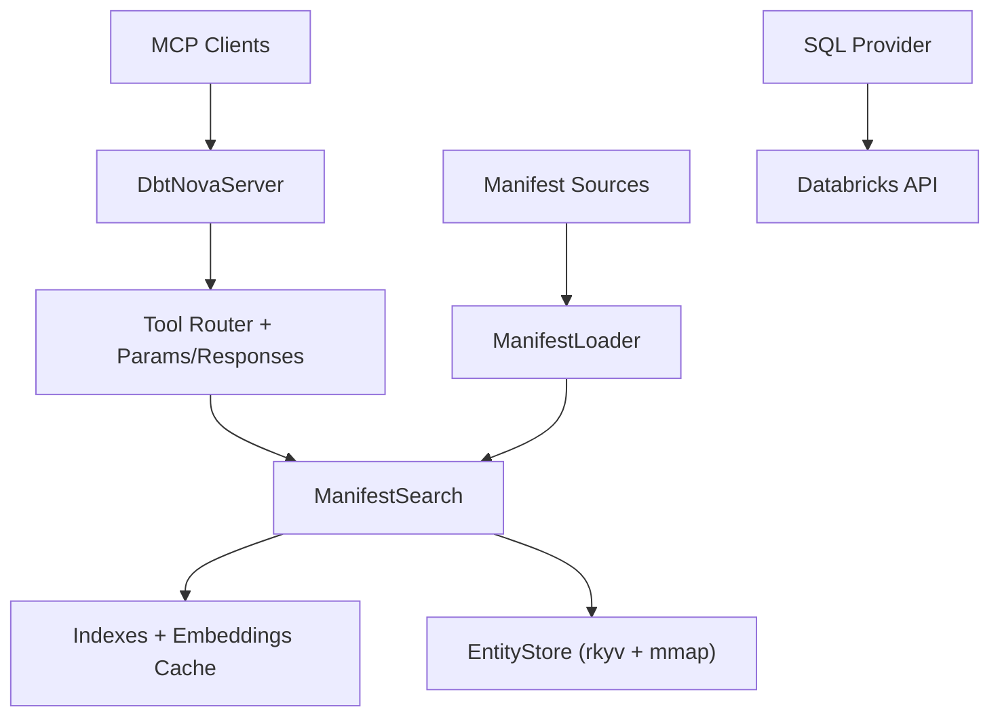
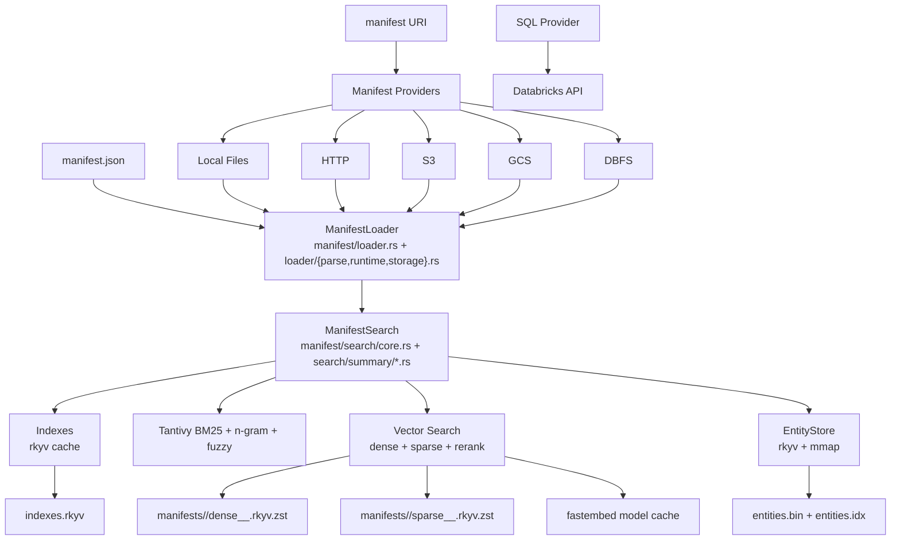

# Architecture

dbt-nova streams the dbt manifest, stores rkyv-encoded `Entity` records (with a
raw JSON payload string for fidelity), and builds/persists indexes for fast queries.

## Design Philosophy

1. **Store Everything** – raw JSON payload preserved alongside typed `Entity`.
2. **Index Everything** – build indexes at load time for O(1) lookups.
3. **Use What dbt Gives Us** – leverage `parent_map`/`child_map`.
4. **Consolidate Tools** – fewer powerful tools over many tiny ones.
5. **Consistent Responses** – standard response envelope for all tools.

## Architecture Overview (Layers)



## Architecture Overview (Detailed)

### Tool Map (42 MCP tools)

```mermaid
flowchart LR
  B["DbtNovaServer<br/>server/mcp.rs"] --> TR["Tool Router"]

  subgraph Discovery["Discovery + Ops"]
    TR --> T_search["search"]
    TR --> T_search_indicator["search_indicator"]
    TR --> T_indicator_inventory["indicator_inventory"]
    TR --> T_search_columns["search_columns"]
    TR --> T_column_inventory["column_inventory"]
    TR --> T_list_entities["list_entities"]
    TR --> T_find_by_path["find_by_path"]
    TR --> T_search_recipes["search_recipes"]
    TR --> T_get_recipe["get_recipe"]
    TR --> T_run_recipe["run_recipe"]
    TR --> T_show_metadata["show_metadata"]
    TR --> T_list_tags["list_tags"]
    TR --> T_list_packages["list_packages"]
    TR --> T_list_databases["list_databases"]
    TR --> T_health["health"]
    TR --> T_reload["reload_manifest"]
  end

  subgraph Entity["Entity Access"]
    TR --> T_get_entity["get_entity"]
    TR --> T_batch_get["batch_get_entities"]
    TR --> T_get_context["get_context"]
  end

  subgraph Lineage["Lineage + Impact"]
    TR --> T_get_lineage["get_lineage"]
    TR --> T_get_column_lineage["get_column_lineage"]
    TR --> T_get_impact["get_impact"]
  end

  subgraph SchemaSQL["Schema + SQL"]
    TR --> T_get_sql["get_sql"]
    TR --> T_get_columns["get_columns"]
    TR --> T_diff_entities["diff_entities"]
    TR --> T_execute_sql["execute_sql"]
  end

  subgraph QualityGov["Quality + Governance"]
    TR --> T_get_test_coverage["get_test_coverage"]
    TR --> T_get_undocumented["get_undocumented"]
    TR --> T_validate_dag["validate_dag"]
    TR --> T_validate_nova_meta["validate_nova_meta"]
    TR --> T_validate_eval_suite["validate_eval_suite"]
    TR --> T_get_eval_gate["get_eval_gate"]
    TR --> T_get_eval_history["get_eval_history"]
    TR --> T_run_eval["run_eval"]
    TR --> T_init_eval_suite["init_eval_suite"]
    TR --> T_run_agent_eval["run_agent_eval"]
    TR --> T_metadata_score["get_metadata_score"]
    TR --> T_metadata_audit["get_metadata_audit"]
    TR --> T_agent_readiness["get_agent_readiness"]
  end

  subgraph Modeling["Modeling Consistency"]
    TR --> T_compare_grains["compare_grains"]
    TR --> T_find_entity_overlap["find_entity_overlap"]
    TR --> T_modeling_report["modelling_consistency_report"]
  end
```

<div class="diagram-large diagram-vertical" markdown>



</div>

### Runtime + Storage Map

<div class="diagram-large" markdown>



</div>

Implementation note:
- `manifest/loader.rs` orchestrates the load flow and delegates parsing, runtime
  helpers, and storage lifecycle functions to `manifest/loader/`.
- persona and Nova metadata summary builders live under
  `manifest/search/summary/` (`persona.rs`, `nova.rs`) to keep search response
  shaping isolated from core query orchestration.

### Tool → Runtime Dependencies

| Tool | Primary components |
| --- | --- |
| `search` | Tantivy + Vector Search |
| `search_indicator` | Nova semantic metadata + ranking indexes |
| `indicator_inventory` | Nova semantic metadata + indexes |
| `search_columns` | Column metadata indexes |
| `column_inventory` | Column metadata indexes |
| `list_entities` | Indexes |
| `find_by_path` | Indexes |
| `search_recipes` | ManifestSearch + manifest `analysis` |
| `get_recipe` | ManifestSearch + manifest `analysis` |
| `run_recipe` | ManifestSearch + execute_sql |
| `show_metadata` | Indexes |
| `list_tags` | Indexes |
| `list_packages` | Indexes |
| `list_databases` | Indexes |
| `health` | ManifestSearch |
| `reload_manifest` | ManifestLoader |
| `get_entity` | EntityStore |
| `batch_get_entities` | EntityStore |
| `get_context` | EntityStore + Indexes |
| `get_lineage` | Indexes |
| `get_column_lineage` | Indexes |
| `get_impact` | Indexes |
| `get_sql` | EntityStore |
| `get_columns` | EntityStore |
| `diff_entities` | EntityStore |
| `execute_sql` | SQL Provider |
| `get_test_coverage` | Indexes |
| `get_undocumented` | Indexes |
| `validate_dag` | Indexes |
| `validate_nova_meta` | Nova metadata YAML validator |
| `validate_eval_suite` | Eval suite validator + local path policy |
| `get_eval_gate` | Eval telemetry + gate logic |
| `get_eval_history` | Eval telemetry |
| `run_eval` | Eval harness + loaded ManifestSearch |
| `init_eval_suite` | Eval suite starter writer |
| `run_agent_eval` | Eval harness + provider process |
| `get_metadata_score` | EntityStore + Indexes |
| `get_metadata_audit` | Metadata Score + Selection/Gate Logic |
| `get_agent_readiness` | Metadata Score + Nova metadata |
| `compare_grains` | Nova metadata + EntityStore |
| `find_entity_overlap` | Nova metadata + Indexes |
| `modelling_consistency_report` | Nova metadata + Indexes |

### Legend

| Node type | Meaning |
| --- | --- |
| **Node** | Runtime component or tool |
| **Grouped subgraph** | Logical layer (API, tools, core, storage, providers) |
| **Arrow** | Primary dependency or data flow |

## Background Loading & Health

`ManifestSearchHandle` builds indexes in the background and transitions through
`Loading → Ready → Refreshing` and can enter `Failed` when startup or refresh
resolution fails. Tools return `INDEX_BUILDING` until a ready index exists; the
`health` tool reports readiness and provides metadata about retrievers.

If a refresh swap fails after a ready manifest is active, Nova keeps serving the
previous index. If startup fails completely, `status` remains `failed` until the
next successful refresh cycle.

## Storage & Concurrency

Nova stores all on-disk artifacts under `<storage_root>/` with a shared embeddings
cache (`.fastembed_cache`) and per-manifest instances:

```
<storage_root>/
  .fastembed_cache/
  manifests/
    <hash>.json
    <hash>.meta.json
  instances/
    manifest-<hash>/
      manifest.current.json
      versions/
        <manifest_hash>/
          entities.bin
          entities.idx
          entities.checksum.json
          index/
          indexes.rkyv
          manifest.signature.json
          .in_use.lock
      .build.lock
    .fastembed_cache/
      manifests/
        <manifest_hash>/
          dense__<model_slug>.rkyv.zst
          sparse__<model_slug>.rkyv.zst
```

Key behaviors:
- **Manifest hash instance IDs**: the same manifest path reuses the same instance dir.
- **Build lock**: only one process builds indexes; others wait (configurable) or reuse.
- **In-use lock**: active instances are protected from pruning/cleanup.
- **Versioned swaps**: refreshed manifests build into a new version directory and swap atomically.
- **Pruning**: old instances/versions are removed by count and/or size limits.

## Project Structure (High Level)

```
dbt-nova/
├── src/
│   ├── main.rs
│   ├── lib.rs
│   ├── config/
│   ├── bin/
│   ├── dbt_types.rs
│   ├── error.rs
│   ├── params.rs
│   ├── responses.rs
│   ├── server/
│   ├── tools/
│   ├── manifest/
│   ├── utils/
│   └── warehouse/
├── tests/
├── docs/
└── examples/
```
