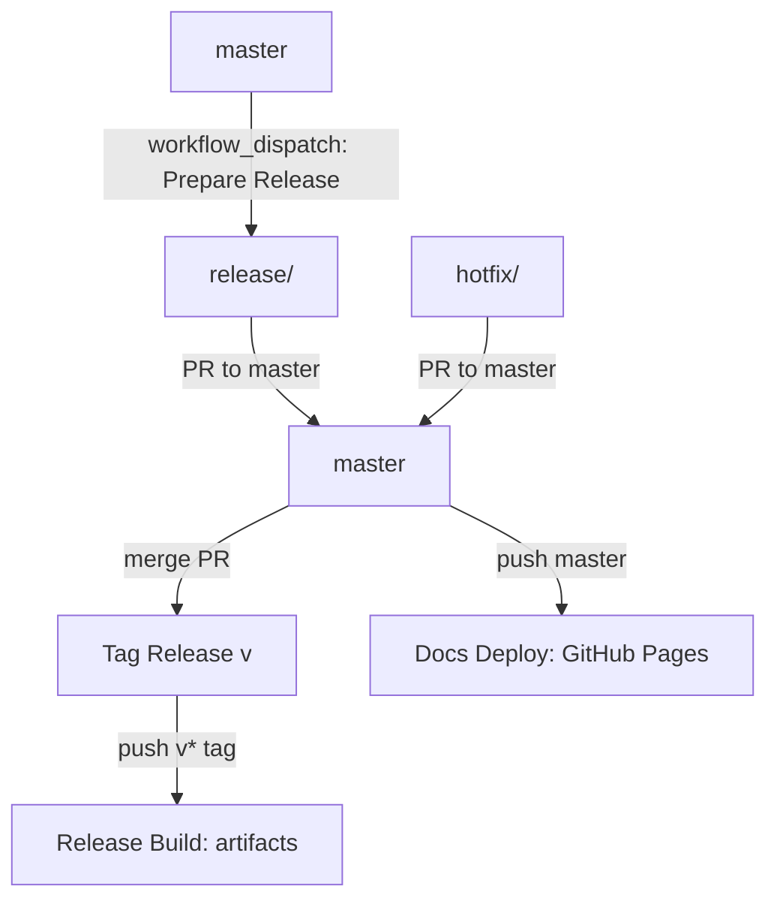

# CI & Automation

This repository uses GitHub Actions for CI, releases, and documentation.

Operational defaults:

- Linux x86_64 runners are pinned to `ubuntu-22.04` for consistency; release
  jobs use native ARM and Intel macOS runners where platform artifacts require
  that architecture.
- Public reusable workflows default to `ubuntu-22.04` but expose `runner` and
  `runner_labels_json` inputs for downstream self-hosted or organization
  runner pools.
- Jobs that execute on local runners set explicit `timeout-minutes` budgets.

## Workflows

### CI

- **File:** `.github/workflows/ci.yml`
- **Trigger:** push on `master` and all pull requests
- **Action:** `cargo fmt --check`, `cargo clippy --locked --all-targets --all-features -- -D warnings`,
  `cargo test --locked --all-features`, `cargo check --locked --no-default-features --all-targets`,
  `cargo check --locked --all-features` on Rust `1.93.0` (MSRV),
  `DBT_NOVA_EVAL_ENABLE_HYBRID=0 DBT_NOVA_EVAL_ENABLE_LIFECYCLE=0 DBT_NOVA_EVAL_ALLOW_EMBEDDING_DOWNLOAD=0 cargo test --locked --test search_eval compare_lexical_vs_hybrid_search_quality -- --ignored`,
  `cargo llvm-cov --locked --all-features --workspace --summary-only` with a
  70 percent line coverage floor,
  `mkdocs build --strict` (with `docs/requirements.txt`), `scripts/check_advisory_ignores.sh`,
  `scripts/check_dependency_watchlist.sh`,
  `scripts/check_config_reference.sh`, `scripts/check_module_size.sh`, and
  `cargo deny check advisories licenses sources`
- **Reusable asset contract checks:** calls the reusable producer workflow in
  standard mode and dry-run remote publish mode, then validates:
  - metadata contract artifact correctness
  - read-only consumer behavior from extracted artifacts
  - native remote consumer behavior via `file://` artifact URIs
  - negative-path behavior (missing/mismatched storage + invalid metadata)
- **Note:** sets `DBT_NOVA_STRICT_SCHEMA=1` so schema parsing failures break the build
- **Note:** release artifacts ship with default features enabled, so lint/test jobs now exercise `--all-features` for parity.

### Reusable Nova Asset Workflow

- **File:** `.github/workflows/nova-build-assets.yml`
- **Use:** reusable workflow invoked by CI and downstream repos
- **Inputs:** `manifest_path` or `manifest_uri`, `storage_instance_id`,
  optional dbt manifest generation with structured invocation
  (`dbt_command_args_json`, optional `dbt_executable`,
  optional `dbt_allow_unsafe_executable`) or trusted shell
  invocation (`dbt_command`), plus `dbt_env_json`,
  `dbt_secret_env_map_json`, optional workflow_call secret bundle
  (`DBT_NOVA_SECRET_BUNDLE_JSON`), optional installer source override
  (`installer_repository`, `installer_ref`, `installer_install_mode`,
  `allow_mutable_installer_ref` for trusted branch-ref development runs), optional models artifact, staged/full semantic warmup
  (`search_warm_strategy`), configurable build timeout
  (`build_timeout_minutes`), optional runner selection (`runner` or
  `runner_labels_json`), optional remote publish
  targets (`s3`, `gcs`, `dbfs`) and `publish_dry_run`; models behavior is
  configured via `models_distribution_mode` (`none|publish_only|publish_and_bootstrap`)
- **Invocation safety:** structured mode runs
  `[dbt_executable, *dbt_command_args_json]` without shell interpolation and is
  the recommended default. By default `dbt_executable` is constrained to
  `dbt`/`dbt.exe`; setting `dbt_allow_unsafe_executable=true` is a trusted-only
  escape hatch. `dbt_command` remains available for trusted callers that require
  shell semantics.
- **Validation:** `dbt_command` and `dbt_command_args_json` are mutually
  exclusive when `dbt_generate_manifest=true`
- **Outputs:** manifest metadata (`manifest_hash`, `manifest_version`,
  `entity_count`), artifact names (including manifest/bootstrap), and optional
  remote publish metadata (`published_targets`,
  `artifact_name_publish_summary`). Legacy `published_*_uris` outputs remain
  for compatibility and currently return `{}`; consumers should read the
  publish-summary artifact JSON.

### Reusable Nova Metadata Audit Workflow

- **File:** `.github/workflows/nova-metadata-audit.yml`
- **Use:** reusable workflow invoked by CI and downstream repos for
  metadata-quality gates and recurring audit reports
- **Inputs:** follows the same installer and dbt invocation contract as
  `.github/workflows/nova-build-assets.yml`:
  `manifest_path` or `manifest_uri`, `storage_instance_id`, optional dbt
  manifest generation with structured invocation
  (`dbt_command_args_json`, optional `dbt_executable`,
  optional `dbt_allow_unsafe_executable`) or trusted shell invocation
  (`dbt_command`), plus `dbt_env_json`, `dbt_secret_env_map_json`, optional
  workflow_call secret bundle (`DBT_NOVA_SECRET_BUNDLE_JSON`), and optional
  installer source override (`installer_repository`, `installer_ref`,
  `installer_install_mode`, `allow_mutable_installer_ref` for trusted branch-ref
  development runs), plus optional runner selection (`runner` or
  `runner_labels_json`)
- **Secret contract:** `dbt_secret_env_map_json` resolves keys from
  `DBT_NOVA_SECRET_BUNDLE_JSON` first, then same-owner inherited workflow
  secrets; downstream wrappers should prefer the bundle pattern for cross-owner
  calls and provider-neutral secret schemas
- **Audit inputs:** `selection_mode` (`project|changed|entities`),
  `changed_files_json`, `entity_ids_json`, `resource_types_json`,
  `personas_json`, `thresholds_json`, `include_breakdown`,
  `include_recommendations`, and `fail_on_no_targets`
- **Outputs:** `gate_status`, `target_count`, `scored_count`,
  `required_fail_count`, `advisory_fail_count`, and report artifact names
- **Performance defaults:** disables dense vectors, sparse vectors, reranking,
  n-grams, and column-lineage precompute so CI can run metadata-only audits
  without paying for full search startup
- **Artifacts:** uploads JSON and Markdown audit reports and appends the
  Markdown report to `GITHUB_STEP_SUMMARY`

### Reusable Workflow Smoke Coverage

- **File:** `.github/workflows/ci.yml`
- **Action:** smoke-tests both reusable workflows directly from the repo
- **Metadata audit checks:** exercises `project`, `changed`, and `entities`
  selection modes, plus both structured and trusted dbt manifest generation
  paths

### Hybrid Search Characterization

- **File:** `.github/workflows/hybrid-search-characterization.yml`
- **Trigger:** nightly schedule plus manual `workflow_dispatch`
- **Action:** runs the ignored `search_eval` harness outside PR CI, uploads the
  raw eval log and `/usr/bin/time -v` resource report, and writes quality,
  latency, lifecycle, and maximum RSS snippets to the workflow summary.
- **Model assets:** restores `~/.dbt-nova-models` from a GitHub Actions cache.
  If cached model files are unavailable and `allow_embedding_download=false`,
  the workflow skips the hybrid profile and records lexical-only output instead
  of failing. Manual runs can opt into downloads and `require_models=true` when
  a prepared runner/cache is expected.
- **Product boundary:** advisory only. It is not a PR gate, not a release SLA,
  and does not make vector, sparse, or reranker search required for Nova's
  default metadata-bridge path.

### Prepare Release

- **File:** `.github/workflows/release-prepare.yml`
- **Trigger:** manual (`workflow_dispatch`)
- **Input:** `version` (must be semantic `x.y.z`, e.g. `1.2.3`)
- **Action:** creates `release/<version>` from `master` and opens a PR to `master`

### Tag Release

- **File:** `.github/workflows/release-tag.yml`
- **Trigger:** PR merged into `master`
- **Gate:** head branch is `release/<version>` or `hotfix/<version>`
- **Action:** creates and pushes tag `v<version>` on the merge commit
- **Requirement:** `RELEASE_TAG_TOKEN` secret (PAT or GitHub App token with
  `contents:write`) so tag pushes trigger downstream workflows

### Release Build

- **File:** `.github/workflows/release.yml`
- **Trigger:** `v*` tag push
- **Action:**
  - validates tag is on `master`
  - validates `Cargo.toml` and `CHANGELOG.md` match the release tag version
  - runs one all-features Linux test gate
  - builds and publishes **slim** assets for `linux-x86_64`, `linux-arm64`,
    `macos-arm64`, and `macos-x86_64`
  - builds, smokes, scans, signs, and publishes a multi-arch `linux/amd64` +
    `linux/arm64` OCI image to `ghcr.io/joe-broadhead/dbt-nova`

### Docs Deploy

- **File:** `.github/workflows/docs.yml`
- **Trigger:** `master` push or manual dispatch
- **Action:** builds MkDocs and publishes to GitHub Pages

## Required Permissions

These workflows use `GITHUB_TOKEN` with:

- `contents: write` for tagging/releases
- `pull-requests: write` for release PR creation
- `pages: write` and `id-token: write` for docs deploy
- `attestations: write` for provenance attestations when supported
- `packages: write` for OCI image publishing to GHCR

Additional secret required:

- `RELEASE_TAG_TOKEN` for `.github/workflows/release-tag.yml`

## Monthly Jobs

- **File:** `.github/workflows/monthly.yml`
- **Trigger:** monthly schedule (first day of month) + manual
- **Action:** short fuzz runs (`manifest_entity`, `nova_meta_yaml`) and `cargo deny` checks
- **Security guard:** advisory ignore metadata/expiry check (`scripts/check_advisory_ignores.sh`)
- **Dependency guard:** watchlist metadata/state check (`scripts/check_dependency_watchlist.sh`)

## Branch Expectations

- Default and release branch: `master`
- Release/hotfix branches are cut from `master`
- Release tags (`v*`) drive binary artifacts; docs deploy from pushes to `master`

## Local Checks (Suggested)

Run these before opening a release PR:

```bash
cargo test --locked --all-features
cargo check --locked --no-default-features --all-targets
cargo check --locked --all-features
cargo clippy --locked --all-targets --all-features -- -D warnings
cargo fmt --check
scripts/smoke_release_no_warm.sh --manifest-path tests/fixtures/starter_eval_manifest.json
scripts/check_config_reference.sh
scripts/check_module_size.sh
scripts/check_dependency_watchlist.sh
pip install -r docs/requirements.txt
mkdocs build --strict
cargo deny check advisories licenses sources
```

For private production-manifest hardening, point the no-warm smoke script at the
generated `target/manifest.json` and pass private bridge/provider suites
explicitly. Do not run semantic warmup on memory-constrained machines unless
the test is specifically about vector, sparse, or reranker cache behavior.

For ranking, retrieval, skill, or eval experiments, include before/after eval
evidence where possible. If the change does not improve accuracy, latency,
maintainability, or agent behavior, record the decision in the
[Negative Results Log](negative-results.md) instead of letting the lesson vanish
inside a closed PR.

## Release Flow Diagram



## Hotfix Checklist

- [ ] Create `hotfix/<version>` from `master`
- [ ] Add fix and update tests/docs as needed
- [ ] Ensure `cargo test --all-features` passes
- [ ] Open PR to `master` and merge
- [ ] Tag auto-created (`v<version>`)
- [ ] Verify release assets and the `master` docs deploy
