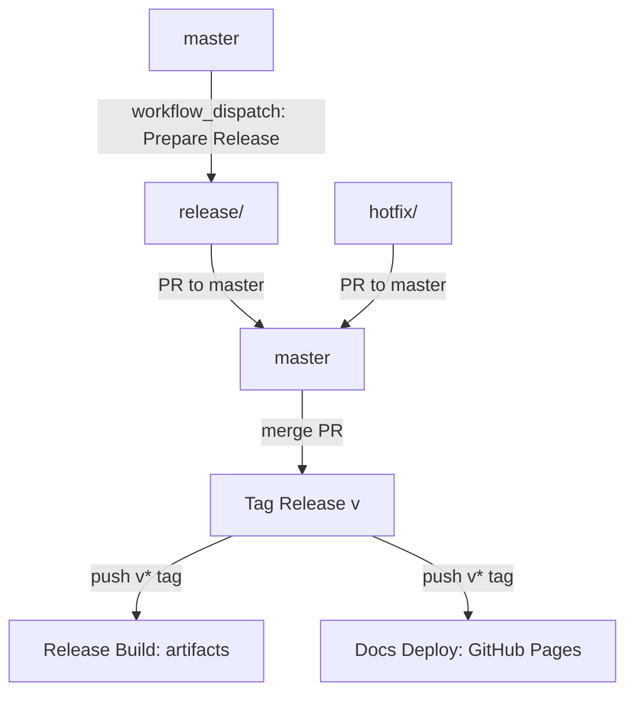

# CI & Automation

This repository uses GitHub Actions for CI, releases, and documentation.

Operational defaults:

- Linux runners are pinned to `ubuntu-22.04` for consistency.
- Jobs that execute on local runners set explicit `timeout-minutes` budgets.

## Workflows

### CI

- **File:** `.github/workflows/ci.yml`
- **Trigger:** push on `master` and all pull requests
- **Action:** `cargo fmt --check`, `cargo clippy --locked --all-targets -- -D warnings`,
  `cargo test --locked`, `cargo check --locked --no-default-features --all-targets`,
  `DBT_NOVA_EVAL_ENABLE_HYBRID=0 DBT_NOVA_EVAL_ENABLE_LIFECYCLE=0 DBT_NOVA_EVAL_ALLOW_EMBEDDING_DOWNLOAD=0 cargo test --locked --test search_eval compare_lexical_vs_hybrid_search_quality -- --ignored`,
  `cargo llvm-cov --locked --all-features --workspace --summary-only`,
  `mkdocs build --strict` (with `docs/requirements.txt`), `scripts/check_advisory_ignores.sh`,
  `scripts/check_dependency_watchlist.sh`,
  `scripts/check_config_reference.sh`, and `cargo deny check advisories licenses sources`
- **Reusable asset contract checks:** calls the reusable producer workflow in
  standard mode and dry-run remote publish mode, then validates:
  - metadata contract artifact correctness
  - read-only consumer behavior from extracted artifacts
  - native remote consumer behavior via `file://` artifact URIs
  - negative-path behavior (missing/mismatched storage + invalid metadata)
- **Note:** sets `DBT_NOVA_STRICT_SCHEMA=1` so schema parsing failures break the build

### Reusable Nova Asset Workflow

- **File:** `.github/workflows/nova-build-assets.yml`
- **Use:** reusable workflow invoked by CI and downstream repos
- **Inputs:** `manifest_path` or `manifest_uri`, `storage_instance_id`,
  optional dbt manifest generation (`dbt_command`, `dbt_env_json`,
  `dbt_secret_env_map_json`), optional workflow_call secret bundle
  (`DBT_NOVA_SECRET_BUNDLE_JSON`), optional installer source override
  (`installer_repository`, `installer_ref`, `installer_install_mode`), optional models artifact, optional remote publish
  targets (`s3`, `gcs`, `dbfs`) and `publish_dry_run`
- **Trust boundary:** when `dbt_generate_manifest=true`, `dbt_command` is
  executed via `bash -lc` in the caller repository context and must be treated
  as trusted caller input
- **Outputs:** manifest metadata (`manifest_hash`, `manifest_version`,
  `entity_count`), artifact names (including manifest/bootstrap), and optional
  published URI JSON objects (`storage`, `manifest`, `metadata`, `bootstrap`,
  optional `models`)

### Prepare Release

- **File:** `.github/workflows/release-prepare.yml`
- **Trigger:** manual (`workflow_dispatch`)
- **Input:** `version` (must be semantic `x.y.z`, e.g. `1.2.3`)
- **Action:** creates `release/<version>` from `master` and opens a PR to `master`

### Tag Release

- **File:** `.github/workflows/release-tag.yml`
- **Trigger:** PR merged into `master`
- **Gate:** head branch is `release/<version>` or `hotfix/<version>`
- **Action:** creates and pushes tag `v<version>` on the merge commit
- **Requirement:** `RELEASE_TAG_TOKEN` secret (PAT or GitHub App token with
  `contents:write`) so tag pushes trigger downstream workflows

### Release Build

- **File:** `.github/workflows/release.yml`
- **Trigger:** `v*` tag push (or manual `workflow_dispatch` with `tag` input)
- **Action:**
  - validates tag is on `master`
  - runs one all-features Linux test gate
  - builds and publishes **slim** assets for `linux-x86_64` and `macos-arm64`

### Docs Deploy

- **File:** `.github/workflows/docs.yml`
- **Trigger:** `v*` tag push
- **Action:** builds MkDocs and publishes to GitHub Pages

## Required Permissions

These workflows use `GITHUB_TOKEN` with:

- `contents: write` for tagging/releases
- `pull-requests: write` for release PR creation
- `pages: write` and `id-token: write` for docs deploy
- `attestations: write` for provenance attestations when supported

Additional secret required:

- `RELEASE_TAG_TOKEN` for `.github/workflows/release-tag.yml`

## Monthly Jobs

- **File:** `.github/workflows/monthly.yml`
- **Trigger:** monthly schedule (first day of month) + manual
- **Action:** short fuzz run (`cargo fuzz`) and `cargo deny` checks
- **Security guard:** advisory ignore metadata/expiry check (`scripts/check_advisory_ignores.sh`)
- **Dependency guard:** watchlist metadata/state check (`scripts/check_dependency_watchlist.sh`)

## Branch Expectations

- Default and release branch: `master`
- Release/hotfix branches are cut from `master`
- Release tags (`v*`) drive both binary artifacts and docs deployment

## Local Checks (Suggested)

Run these before opening a release PR:

```bash
cargo test --locked
cargo check --locked --no-default-features --all-targets
cargo clippy --locked --all-targets -- -W clippy::all -W clippy::pedantic
cargo fmt --check
scripts/check_config_reference.sh
scripts/check_dependency_watchlist.sh
pip install -r docs/requirements.txt
mkdocs build --strict
cargo deny check
```

## Release Flow Diagram



## Hotfix Checklist

- [ ] Create `hotfix/<version>` from `master`
- [ ] Add fix and update tests/docs as needed
- [ ] Ensure `cargo test` passes
- [ ] Open PR to `master` and merge
- [ ] Tag auto-created (`v<version>`)
- [ ] Verify release assets and docs deploy
